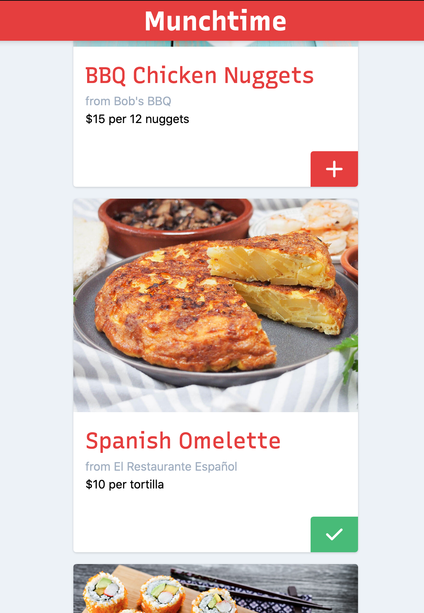

# Munchtime
## An open source food delivery app for a worker-owned platform cooperative.

I know, that's a lot to take in. What does it all mean?

1. Since Munchtime is open source, the code is open for all to see and anyone can contribute to it.
2. When Munchtime finally goes live, the platform will be owned by the people doing the work: the software developers maintaining the platform and the people delivering the food. Everyone who relies on the platform should own and control the platform.

Munchtime is still a work in progress, but here's a screenshot while you wait:

